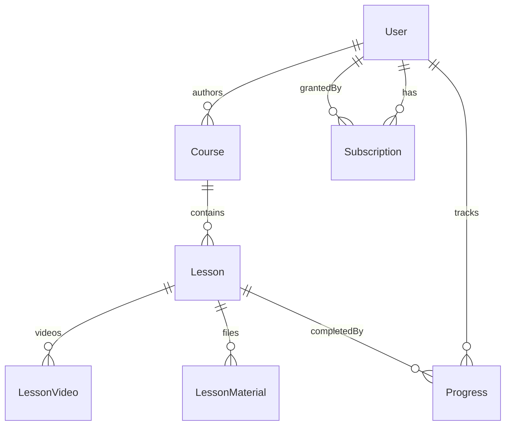

# 02. Database Schema (Prisma)

## Цель
Описать модель данных в Prisma и подготовить миграции.

## ER-диаграмма



## `schema.prisma`

```prisma
generator client { provider = "prisma-client-js" }
datasource db { provider = "postgresql"; url = env("DATABASE_URL") }

enum Role { ADMIN AUTHOR SUBSCRIBER }
enum CourseStatus { DRAFT PUBLISHED ARCHIVED }
enum SubscriptionStatus { ACTIVE EXPIRED REVOKED }
enum SubscriptionPlan { BASIC PRO }

model User {
  id            String   @id @default(cuid())
  email         String   @unique
  passwordHash  String
  fullName      String
  role          Role     @default(SUBSCRIBER)
  avatarUrl     String?
  createdAt     DateTime @default(now())
  updatedAt     DateTime @updatedAt

  courses        Course[]        @relation("CourseAuthor")
  subscriptions  Subscription[]  @relation("UserSubscriptions")
  grantedSubs    Subscription[]  @relation("GrantedBy")
  progress       Progress[]
  refreshTokens  RefreshToken[]
}

model RefreshToken {
  id        String   @id @default(cuid())
  userId    String
  tokenHash String   @unique
  expiresAt DateTime
  createdAt DateTime @default(now())
  user      User     @relation(fields: [userId], references: [id], onDelete: Cascade)

  @@index([userId])
}

model Course {
  id          String        @id @default(cuid())
  authorId    String
  title       String
  description String
  coverUrl    String?
  status      CourseStatus  @default(DRAFT)
  createdAt   DateTime      @default(now())
  updatedAt   DateTime      @updatedAt

  author  User      @relation("CourseAuthor", fields: [authorId], references: [id])
  lessons Lesson[]

  @@index([authorId, status])
}

model Lesson {
  id          String   @id @default(cuid())
  courseId    String
  title       String
  content     String   @db.Text
  orderNumber Int
  createdAt   DateTime @default(now())
  updatedAt   DateTime @updatedAt

  course    Course           @relation(fields: [courseId], references: [id], onDelete: Cascade)
  videos    LessonVideo[]
  materials LessonMaterial[]
  progress  Progress[]

  @@unique([courseId, orderNumber])
}

model LessonVideo {
  id                  String   @id @default(cuid())
  lessonId            String
  title               String
  cloudinaryPublicId  String   @unique
  url                 String
  durationSeconds     Int
  sizeBytes           BigInt
  orderNumber         Int      @default(1)
  createdAt           DateTime @default(now())

  lesson Lesson @relation(fields: [lessonId], references: [id], onDelete: Cascade)
}

model LessonMaterial {
  id                  String   @id @default(cuid())
  lessonId            String
  title               String
  cloudinaryPublicId  String   @unique
  url                 String
  mimeType            String
  sizeBytes           BigInt
  createdAt           DateTime @default(now())

  lesson Lesson @relation(fields: [lessonId], references: [id], onDelete: Cascade)
}

model Subscription {
  id           String              @id @default(cuid())
  userId       String
  plan         SubscriptionPlan    @default(BASIC)
  status       SubscriptionStatus  @default(ACTIVE)
  startsAt     DateTime            @default(now())
  expiresAt    DateTime
  grantedById  String
  createdAt    DateTime            @default(now())
  updatedAt    DateTime            @updatedAt

  user      User @relation("UserSubscriptions", fields: [userId], references: [id], onDelete: Cascade)
  grantedBy User @relation("GrantedBy",         fields: [grantedById], references: [id])

  @@index([userId, status])
}

model Progress {
  id          String   @id @default(cuid())
  userId      String
  lessonId    String
  completedAt DateTime @default(now())

  user   User   @relation(fields: [userId],   references: [id], onDelete: Cascade)
  lesson Lesson @relation(fields: [lessonId], references: [id], onDelete: Cascade)

  @@unique([userId, lessonId])
}
```

## Замечания
- У пользователя может быть несколько `Subscription` (история); активной считается та, у которой `status=ACTIVE && expiresAt > now`. Можно завести вьюшку или вычислять в сервисе.
- `LessonVideo` хранит только метаданные; сам файл — в Cloudinary.
- При удалении курса каскадно удаляются уроки/видео/материалы; ассеты Cloudinary удаляются явно сервисом `MediaService` (см. `07-media-cloudinary.md`).

## Скрипты

```bash
npx prisma migrate dev --name init
npx prisma generate
npm run seed   # создаёт пользователя ADMIN из env
```

## Definition of Done
- [ ] Все enum и модели реализованы как выше.
- [ ] Миграция `init` создаётся и применяется к чистой БД.
- [ ] `prisma studio` показывает все таблицы.
- [ ] Есть `prisma/seed.ts`, создающий админа из env (`SEED_ADMIN_EMAIL`, `SEED_ADMIN_PASSWORD`).
