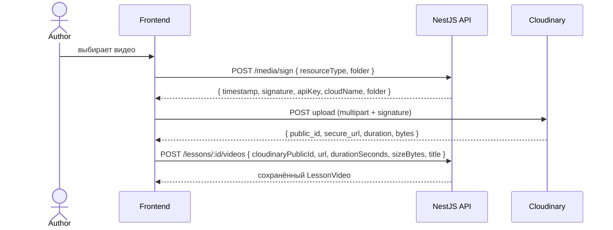

# 07. Media Module (Cloudinary)

## Цель
Интегрировать **Cloudinary** для хранения изображений и видео. Загружать файлы напрямую с фронта на Cloudinary через **подписанные параметры**, а на бэк отправлять только метаданные.

## Архитектура потока загрузки



## Структура модуля

```
modules/media/
  media.controller.ts
  media.service.ts
  media.module.ts
  dto/
    sign-upload.dto.ts
    sign-response.dto.ts
```

## Endpoints

| Метод | Путь                       | Описание                                              | Доступ          |
|-------|----------------------------|-------------------------------------------------------|-----------------|
| POST  | `/api/v1/media/sign`       | Получить подписанные параметры для аплоада            | AUTHOR / ADMIN  |
| POST  | `/api/v1/media/sign/avatar`| То же, но `folder=avatars/{userId}` и тип `image`     | JWT             |

## DTO

```ts
enum UploadResourceType { IMAGE = 'image', VIDEO = 'video', RAW = 'raw' }

class SignUploadDto {
  @IsEnum(UploadResourceType) resourceType: UploadResourceType;
  @IsString() folder: string;       // например, "courses/{courseId}/lessons/{lessonId}/videos"
  @IsString() @IsOptional() publicId?: string;
}

class SignResponseDto {
  cloudName: string;
  apiKey: string;
  timestamp: number;
  signature: string;
  folder: string;
  resourceType: UploadResourceType;
  publicId?: string;
}
```

## Реализация `MediaService`

```ts
import { v2 as cloudinary } from 'cloudinary';

@Injectable()
export class MediaService implements OnModuleInit {
  onModuleInit() {
    cloudinary.config({
      cloud_name: this.config.get('CLOUDINARY_CLOUD_NAME'),
      api_key:    this.config.get('CLOUDINARY_API_KEY'),
      api_secret: this.config.get('CLOUDINARY_API_SECRET'),
    });
  }

  sign(input: SignUploadDto): SignResponseDto {
    const timestamp = Math.round(Date.now() / 1000);
    const paramsToSign: Record<string, string | number> = { timestamp, folder: input.folder };
    if (input.publicId) paramsToSign.public_id = input.publicId;

    const signature = cloudinary.utils.api_sign_request(
      paramsToSign,
      this.config.get('CLOUDINARY_API_SECRET')!,
    );

    return {
      cloudName: this.config.get('CLOUDINARY_CLOUD_NAME')!,
      apiKey:    this.config.get('CLOUDINARY_API_KEY')!,
      timestamp,
      signature,
      folder: input.folder,
      resourceType: input.resourceType,
      publicId: input.publicId,
    };
  }

  async deleteByPublicIds(publicIds: string[], resourceType: UploadResourceType): Promise<void> {
    if (!publicIds.length) return;
    await cloudinary.api.delete_resources(publicIds, { resource_type: resourceType });
  }
}
```

## Ограничения и валидации
- Разрешённые типы:
  - Image: `image/jpeg`, `image/png`, `image/webp`, до **5 MB**.
  - Video: `video/mp4`, `video/webm`, до **500 MB**.
  - Raw (документы): `application/pdf`, `application/msword`, `application/vnd.openxmlformats-officedocument.*`, до **50 MB**.
- Эти лимиты также прописаны на стороне фронта; на бэке проверяются при `attachVideo/Material` через сравнение `sizeBytes`.
- Структура папок:
  - `avatars/{userId}`
  - `courses/{courseId}/cover`
  - `courses/{courseId}/lessons/{lessonId}/videos`
  - `courses/{courseId}/lessons/{lessonId}/materials`

## Интеграция с другими модулями
- `CoursesService.delete` вызывает `MediaService.deleteByPublicIds` для обложки.
- `LessonsService.delete` чистит видео и материалы.
- `UsersService.updateProfile` при смене аватара сначала удаляет старый ассет.

## Definition of Done
- [ ] `/media/sign` возвращает корректные параметры — фронт может загрузить тестовый файл.
- [ ] Загруженный файл появляется в Cloudinary в правильной папке.
- [ ] Удаление курса/урока/материала чистит Cloudinary.
- [ ] Секреты Cloudinary не утекают на фронт (`api_secret` остаётся только на бэке).
